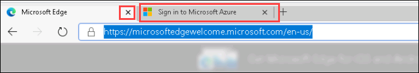

# Exercise 1: Login to Azure Portal (as admin)

 
 

## Instructions 

 
 

1. Once the environment is provisioned, a virtual machine (JumpVM) and lab guide will get loaded in your browser. Use this virtual machine throughout the workshop to perform the lab. 

 
 

2. To get the lab environment details, you can select the **Lab Environment** tab. Additionally, the credentials will also be emailed to your email address provided at registration. 

  

    > You will see Deployment ID value on **Lab Environment** tab, use it wherever you see SUFFIX or DeploymentID in lab steps. 

  

3. You can also open the Lab Guide on Separate full window by selecting the **Arrow** icon in the upper right corner. 

  

## Login to Azure Portal 

 
 

1. In the JumpVM, click on the Azure portal shortcut of Microsoft Edge browser which is created on the desktop. 

    

2. When you click on Azure portal, the edge browser welcome screen will come up, select **Get started**. 

 
 

    

    

3. On the next window, click on **Confirm**. 

 
 

    

    

4. Now, you can close the popup which is coming up. 

 
 

    

    

5. Now, you will see two tabs in the edge browser, close the first tab named **Microsoft Edge**. 

 
 

    

    

6. On the **Sign into Microsoft Azure** tab, you will see the login screen, enter the following email/username, and, then click on **Next**.  

   * Email/Username: <inject key="AzureAdUserEmail"></inject> 

    

      

      

7. Now enter the following password and click on **Sign in**. 

   * Password: <inject key="AzureAdUserPassword"></inject> 

    

      

      

8. If you see the pop-up **Stay Signed in?**, click on No 

 
 

9. If you see the pop-up **You have free Azure Advisor recommendations!**, close the window to continue the lab. 

 
 

10. If a **Welcome to Microsoft Azure** popup window appears, click **Maybe Later** to skip the tour. 

## Review all the user created and updating the department field for 3 users

1. Now you will see Azure Portal Dashboard, Go to the search bar in the top search and select **Azure Active Directory**.

   

2. Now you will see the **Azure Active Directory Overview** page.

   

3. Click on the **Users** blade under manage section.

   

4. Now you will see the page of all the users in aad, Review all the user created and click on user **Allan Deyoung**.

   

5. Update the department field of by clicking on **Edit**.

   

6. Go to **Department** field and add **Retail** in the box, Do the same to the other users **Alex Wilber** and **Adele Vance**.

   

# Exercise 2: Create a dynamic group in Azure Active Directory.

1. Click on the **Groups** blade under manage section.

   

2. Now click on add **New Group**.

   

3. On the **New Group** tab, fill in the fields with the following details and click on **Add dynamic query**.

    | Settings | Value |
    |--|--|
    | Group type | **Security** |
    | Group name |  **Retail Users** |
    | Group description | **Retail** |
    | Membership type | **Dynamic User** |
    | | |

   

3. On the **Dynamic membership rules** tab, fill in the fields with the following details and click on **Save** and **Create**.

    | Settings | Value |
    |--|--|
    | Property | **department** |
    | Operator |  **contains** |
    | Value | **Retail** |
    | | |

   

4. Now you can see the newly created group named **Retail Users** click on the group.

   

6. Go to the **Members** blade under manage Selection, You can see the users which are having **Retail** as the department are dynamically added as members in these group.

   

   > Note: If you didn't see the users, Wait for 5 mins and check again.