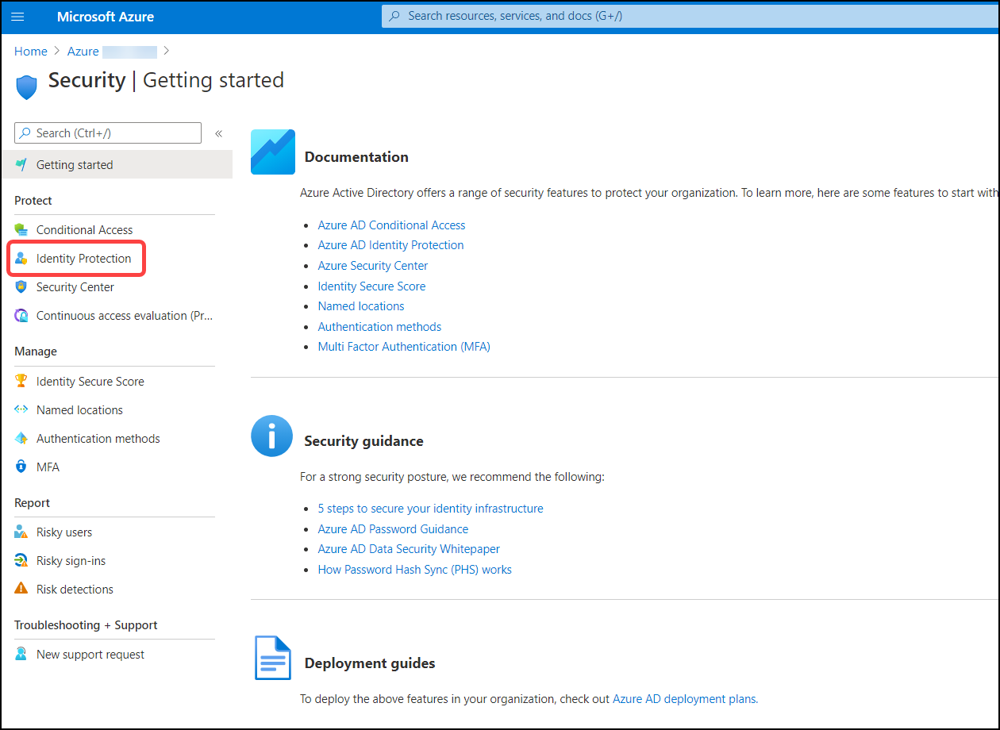
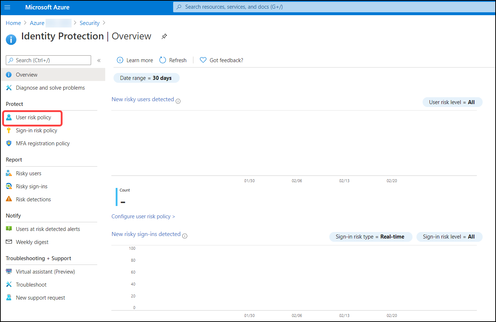
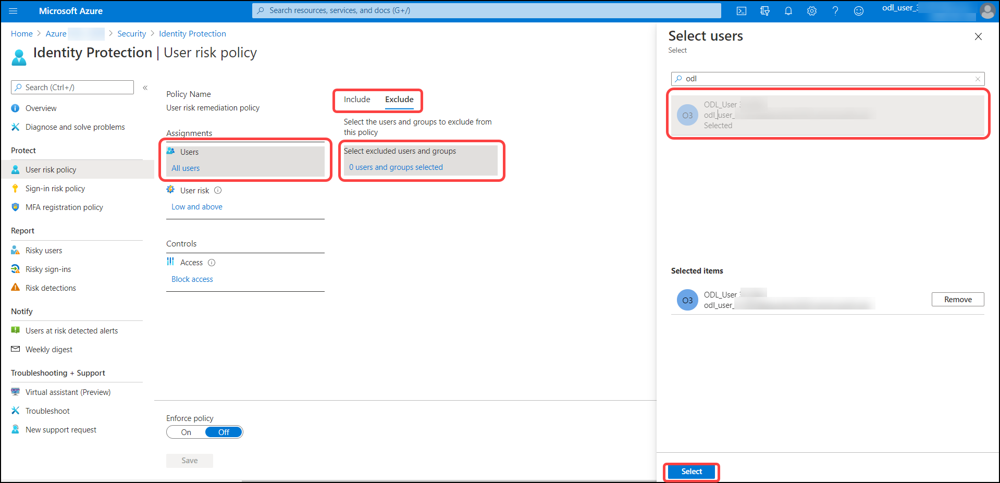
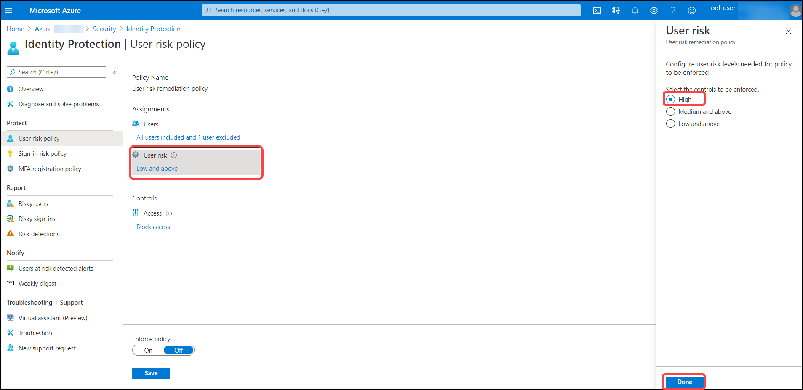
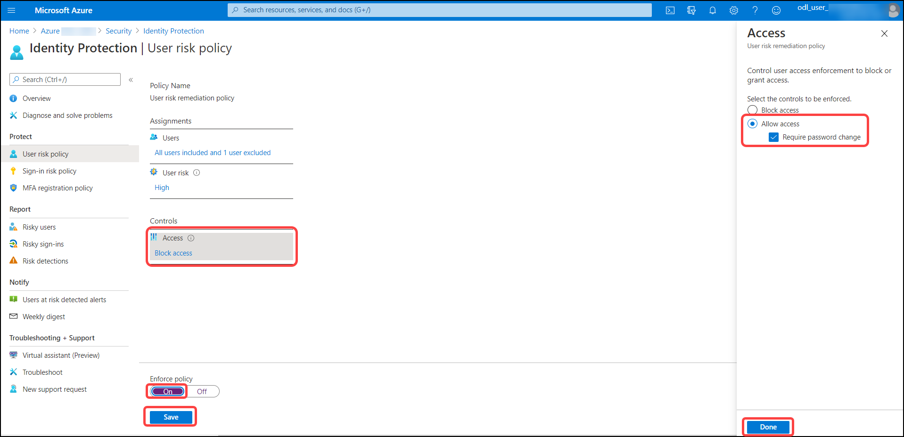
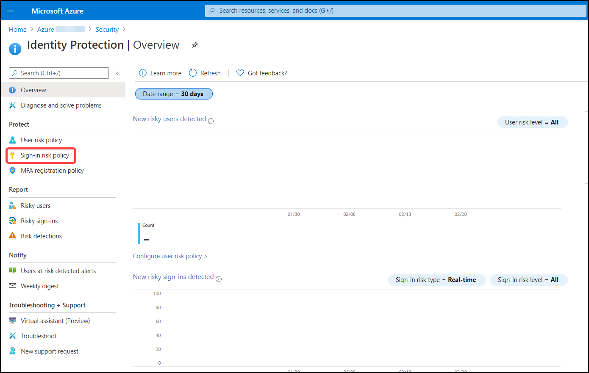
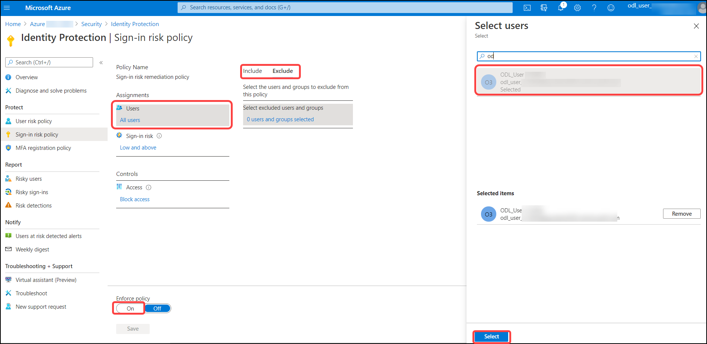
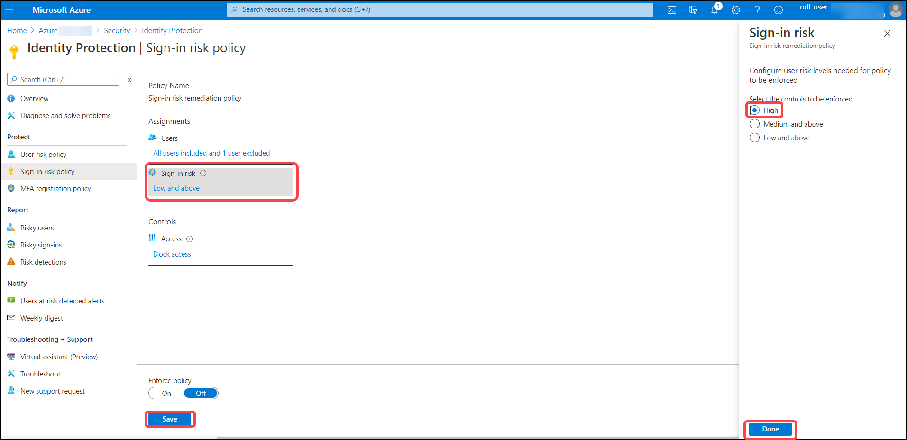
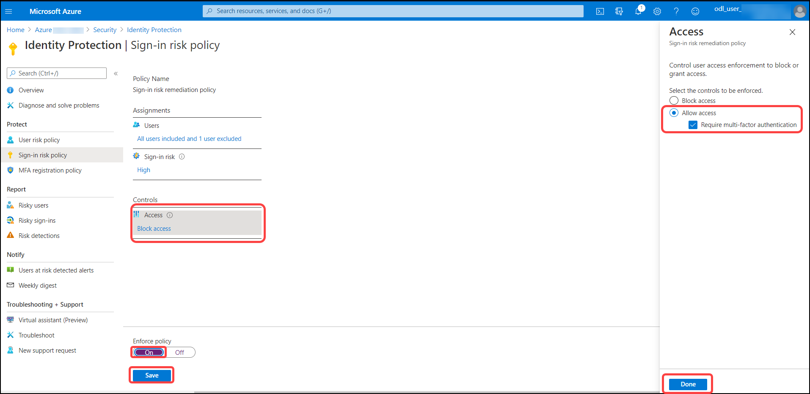

# Exercise 3: Configure the User Risk policy and exclude the admin account.

## To enable the user risk and sign-in risk policies complete the following steps.

### Browse to Azure Active Directory > Security > Identity Protection > Overview
1. Click on **Security**.

   

2. Click on **Identity Protection**.

   

3. Click on **User risk policy**.

   

4. On the **User risk policy** tab, Under assignments select **Users** fields with the following details then click on **select**.

    | Settings | Value |
    |--|--|
    | Users>include | **All users**  |
    | Users>exclude | **admin account** "The user one which you're used to login into azre portal, It starts with **Odl_User**" |
    | | |

   

5. On the **User risk policy** tab, Under assignments select **User risk** and select **High** then click on **Done**.

   

6. On the **User risk policy** tab, Under assignments select **Access** fields with the following details then click on **Done** and **Save**.

    | Settings | Value |
    |--|--|
    | Access | **Allow access, Required password change**  |
    | Enforce policy | **on**  |
    | | |

   

# Exercise 4: Configure the Sign-in risk policy and exclude the admin account.

### Browse to Azure Active Directory > Security > Identity Protection > Overview
1. 3. Click on **Sign-in risk policy**.

   

2. On the **Sign-in risk policy** tab, Under assignments select **Users** fields with the following details then click on **select**.

    | Settings | Value |
    |--|--|
    | Users>include | **All users**  |
    | Users>exclude | **admin account** "The user one which you're used to login into azre portal, It starts with **Odl_User**" |
    | | |

   

3. On the **Sign-in risk policy** tab, Under assignments select **Sign-in risk** and select **High** then click on **Done**.

   

4. 6. On the **Sign-in risk policy** tab, Under assignments select **Access** fields with the following details then click on **Done** and **Save**.

    | Settings | Value |
    |--|--|
    | Access | **Allow access, Required password change**  |
    | Enforce policy | **on**  |
    | | |

   