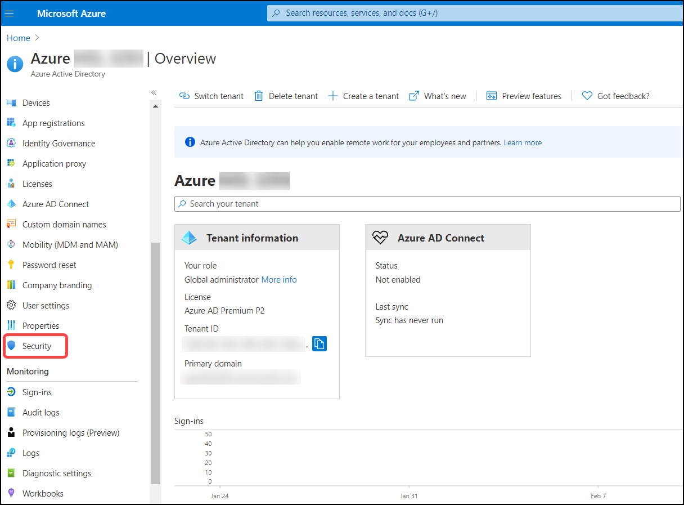
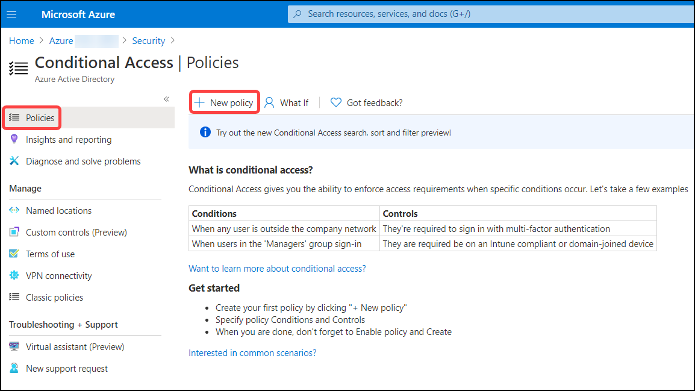
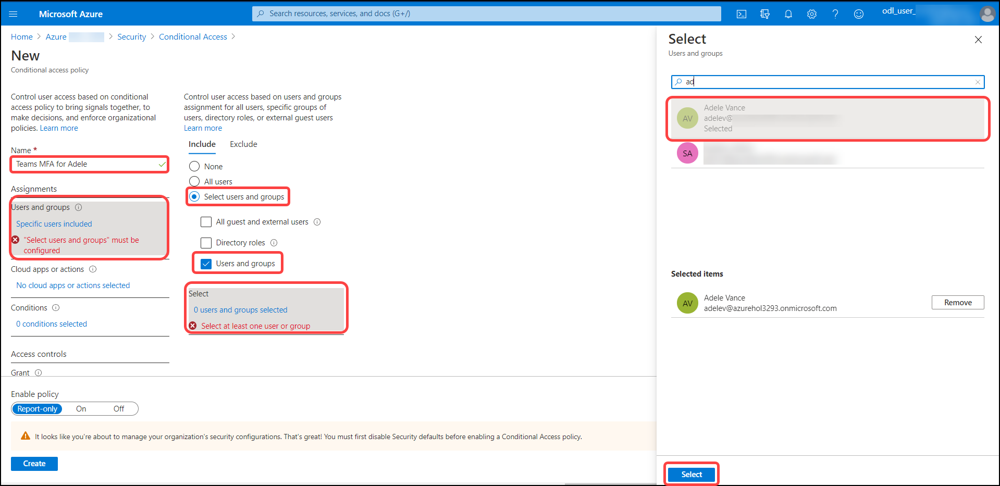
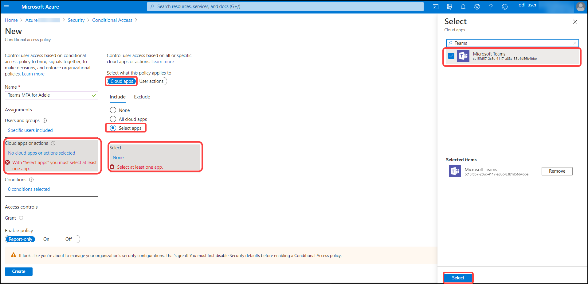
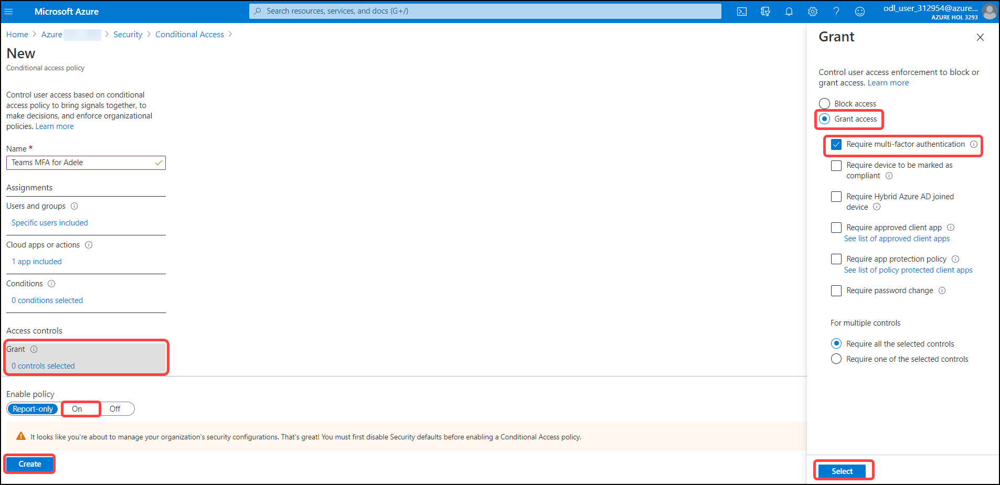

# Exercise: 6 Create a Conditional Access policy to require MFA when accessing Teams and apply to Adele Vance.

## Browse to Azure Active Directory > Security > Conditional Access.

1. 1. Click on **Security**.

   

2. Click on **Conditional Access**.

   

3. Click on add **New policy**.

   

4. Give policy a name **Teams MFS for Adele**, Under Assignments, select **Users and groups**, Under Include, select **Users and groups**, Search and select user **Adele Vance** and click on select.

   

5. Under **Cloud apps or actions** > Include, select **Select apps**, Search and select **Microsoft Teams** and click on select.

   

6. Under **Access controls** > **Grant**, select **Grant access**, **Require multi-factor authentication**, click **Select**, set **Enable policy** to **On** and Select **Create** to create to enable the policy.

   