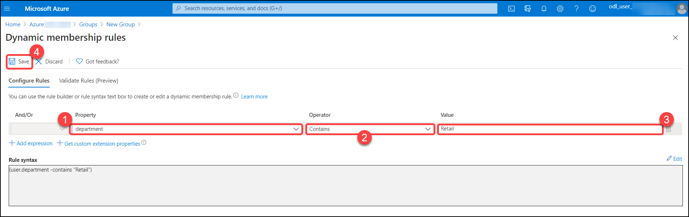

# Exercise 1: Log in to Azure Portal (as admin)

## Instructions 

 
 

1.	After the environment is provisioned successfully your browser will load up the **Lab Guide** along with a virtual machine called JumpVM. This virtual machine will be your platform throughout the course of the workshop. 

 
 

2.	All user credentials for accessing the Azure Portal can be viewed under the **Environment Details** tab for ease of access. Do note that the same information will also be sent to your registered email address.

  

3. The Lab Guide can also be opened on a separate window by selecting the **Split Window** icon in the bottom right corner. This will result in the window detaching from the right side providing more on-screen space for your virtual machine. 

  

## Login to Azure Portal 

 
 

1. To Login you need to first launch the Azure Portal application from the desktop shortcut using the JumpVM.  

   

2. Select **Get started** for Edge browser prompts. 

 
 

    

    

3. On the next window, click on **Confirm**. 

 
 

    

    

4. Please close the pop-up by clicking **Continue without signing-in** . 

 
 

    

    

5. By default, you will see two open tabs on your edge browser. Close the tab named **Microsoft Edge**, now you will be on the **Sign in to Microsoft Azure login page**. 

 
 

    

    

6. On the **Sign into Microsoft Azure** tab, you will see the login screen, enter the following email/username, and, then click on **Next**.  

   * Email/Username: <inject key="AzureAdUserEmail"></inject> 

    

    

      

7. Now enter the following password and click on **Sign in**. 

   * Password: <inject key="AzureAdUserPassword"></inject> 

    

    

      

8. Click on **No**, if you see a pop up window asking you to **Stay signed in**. 

 
 

9. Incase you see the pop-up window stating that **You have free Azure Advisor recommendations!** close the window and continue with the lab. 

 
 

10. If a **Welcome to Microsoft Azure** popup window appears, click **Maybe Later** to skip the tour. 

## Review all the users created and updating the department field for 3 users

Your lab environment is pre-loaded with 5 users. You will be testing various end user scenarios throughout the lab exercises on these pre-created users. In this task, we will be updating the value of department field for 3 users. We will be using this value in next exercise to create group

1. In Azure Portal Dashboard, you will find the **Search bar** situated on the top of the page, type **Azure Active Directory** and click to open it.

   

2. Now you will see the **Azure Active Directory Overview** page.

   

3. Click on the **Users** blade under the manage section.

   

4. This page contains all the available users in AzureAD. Review them and click on user **Allan Deyoung**.

   

5. To update the department field, click on **Edit**.

   

6. Under **Job info** section you will find the **Department** field, type **Retail** and click on **Save**. Repeat the entire process and add two additional users- **Alex Wilber** and **Adele Vance**.

   

You have now successfully updated the department for 3 users. 

# Exercise 2: Create a dynamic group in Azure Active Directory.

Azure Active Directory (Azure AD) is a cloud-based directory and identity management service that combines core directory services, application access management, and identity protection into a single solution. To simplify things, with the help of Azure Active Directory, you can create complex attribute-based rules to enable dynamic memberships for groups. Dynamic group membership reduces the administrative overhead of adding and removing users. This article details the properties and syntax to create dynamic membership rules for users or devices. You can set up a rule for dynamic membership on security groups or Microsoft 365 groups. 

In this exercise, We will be creating group for **Retail** users.

1. Click on the **Groups** blade under the manage section.

   

2. Click on add **New Group**.

   

3. On the **New Group** tab, fill in the fields with the following details and click on **Add dynamic query**.

    | Settings | Value |
    |--|--|
    | Group type |         **Security** |
    | Group name |         **Retail Users** |
    | Group description |  **Retail** |
    | Membership type |    **Dynamic User** |
    | | |

   

3. On the **Dynamic membership rules** tab, fill in the fields with the following details and click on **Save** and **Create**.

    | Settings | Value |
    |--|--|
    | Property | **department** |
    | Operator |  **contains** |
    | Value | **Retail** |
    | | |

   

4. Now you can see the newly created group named **Retail Users**. click on the group.

   

6. Navigate to the **Members** blade under manage Selection. Here you can see the users with **Retail** as their department are dynamically added as members in these group. Please note that it may take few minutes before the members are populated.

   

   > Note: If you do not see the users, Wait for 5 mins and check again.
   > 

You have now created a dynamic group based on department. 
