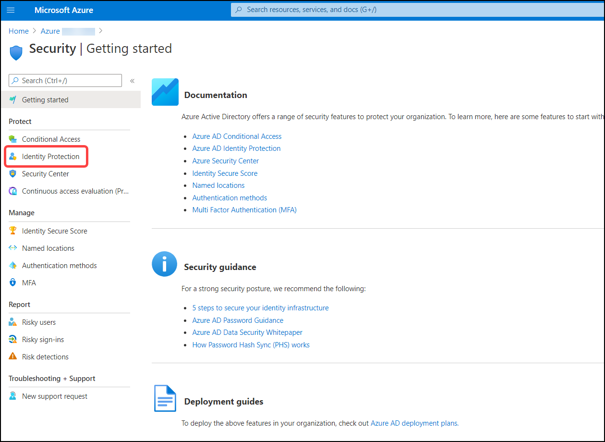
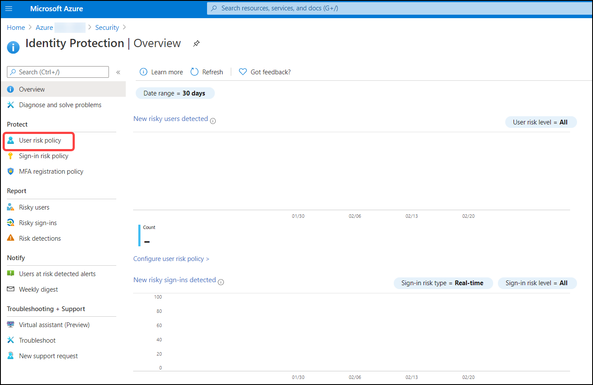
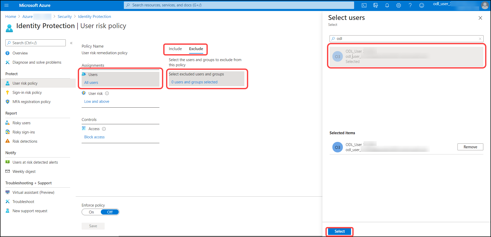
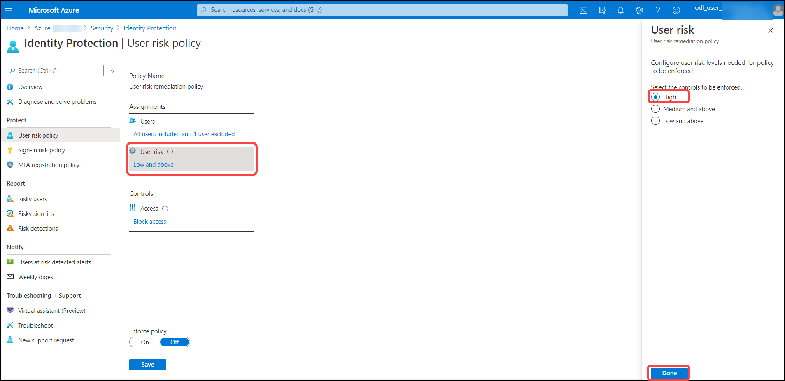
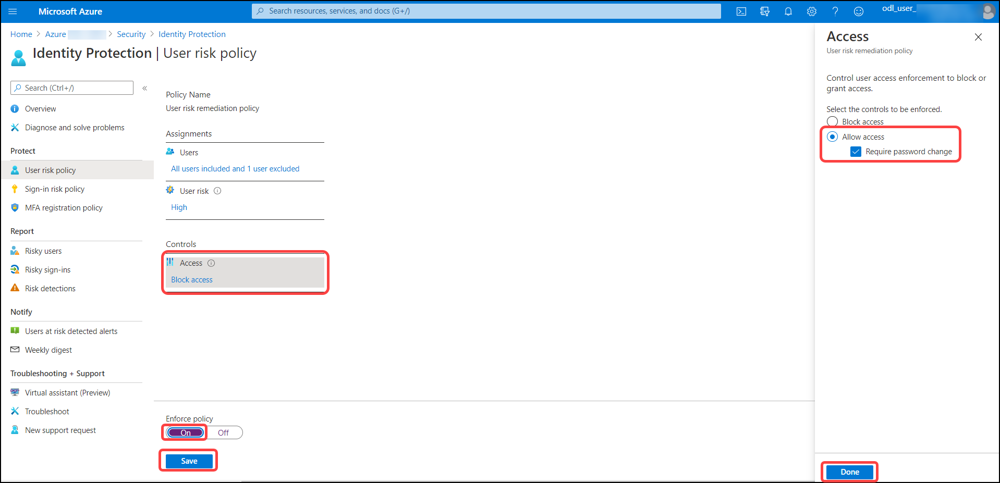
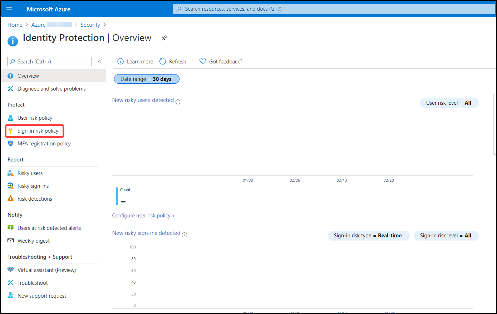
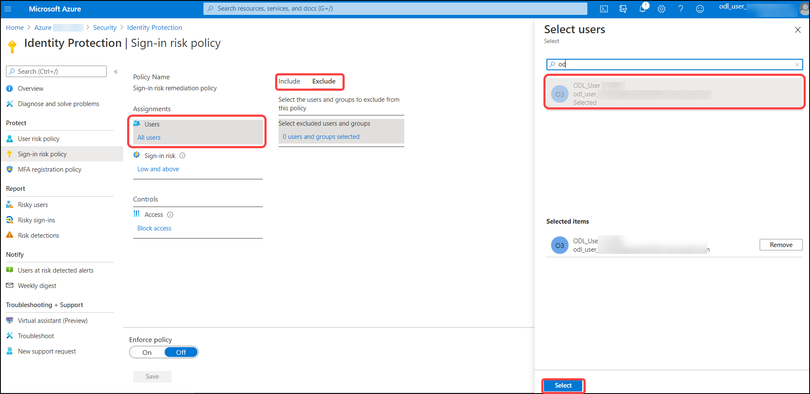
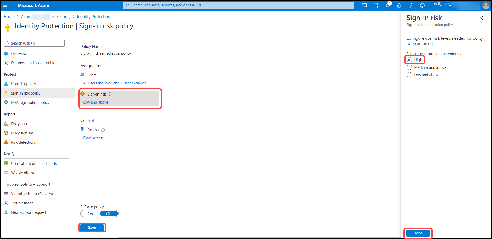
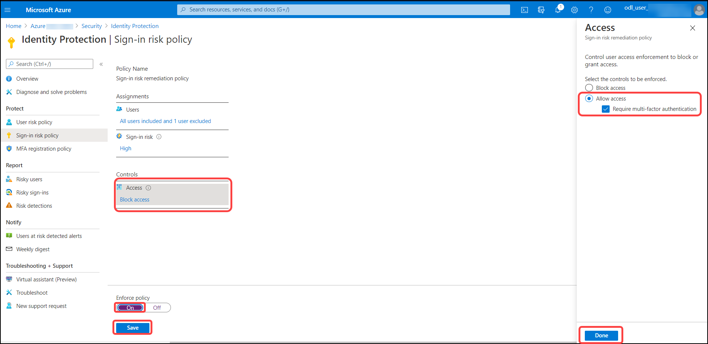

# Exercise 3: Configure the User Risk policy and exclude the admin account.
Azure AD Identity Protection can calculate what it believes is normal for a user's behavior and use that to base decisions for their risk. User risk is a calculation of probability that an identity has been compromised. Administrators can make a decision based on this risk score signal to enforce organizational requirements.

In this section, we will be configuring User Risk policy for **retail** users. We will exclude the administrator user from this policy. 

1. In Azure Portal, Navigate to Azure AD > Security > Identity Protection > Overview. Click on **Security**.

   

2. Click on **Identity Protection**.

   

3. Click on **User risk policy**.

   

4. On the **User risk policy** tab, Under assignments, select **Users** fields with the following details then click on **select**.

    | Settings | Value |
    |--|--|
    | Users>include | **All users**  |
    | Users>exclude | **admin account** "The user one which you're used to login into azure portal, It starts with **Odl_User**" |
    | | |

   

5. On the **User risk policy** tab, Under assignments select **User risk** and select **High** then click on **Done**.

   

6. On the **User risk policy** tab, Under assignments select **Access** fields with the following details, then click on **Done** and **Save**.

    | Settings | Value |
    |--|--|
    | Access | **Allow access and Required password change**  |
    | Enforce policy | **On**  |
    | | |

   

You have now completed creating a user risk policy. 

# Exercise 4: Configure the Sign-in risk policy and exclude the admin account.

Identity Protection analyzes signals from each sign-in, both real-time and offline, and calculates a risk score based on the probability that the sign-in wasn't performed by the user. Administrators can make a decision based on this risk score signal to enforce organizational requirements. Administrators can choose to block access, allow access, or allow access but require multi-factor authentication.

In this section, we will create a sign-in risk policy. 

1. Navigate to  Azure Active Directory > Security > Identity Protection > Overview. Click on **Sign-in risk policy**.

   

2. On the **Sign-in risk policy** tab, Under assignments select **Users** fields with the following details then click on **select**.

    | Settings | Value |
    |--|--|
    | Users>include | **All users**  |
    | Users>exclude | **admin account** "The user one which you're used to login into azure portal, It starts with **Odl_User**" |
    | | |

   

3. On the **Sign-in risk policy** tab, Under assignments select **Sign-in risk** and select **High** then click on **Done**.

   

4. 6. On the **Sign-in risk policy** tab, Under assignments select **Access** fields with the following details then click on **Done** and **Save**.

    | Settings | Value |
    |--|--|
    | Access | **Allow access and Require multi-factor authentication**  |
    | Enforce policy | **On**  |
    | | |

   
   
You have now completed creating a sign-in risk policy.
