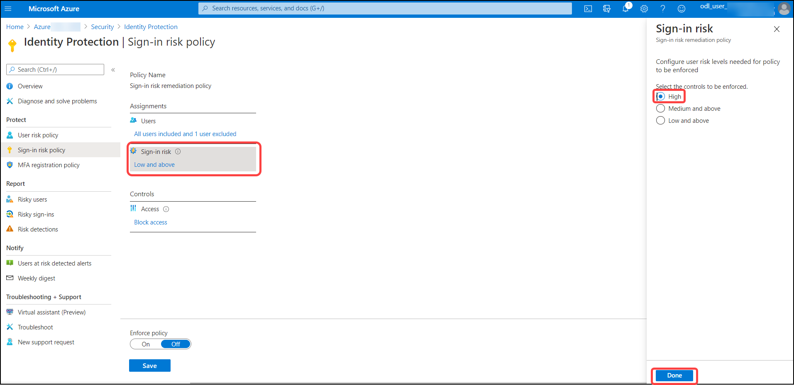

# Exercise 3: Configure the User Risk policy and exclude the admin account.
Azure AD Identity Protection is an identity admin’s toolbox to prevent, detect and remediate identity risk in their organization. It monitors every login for identity compromise using numerous detection methods. These detections can be based on heuristics or machine learning or they can come from partner products. Azure AD Identity Protection detects abnormal behavior among users and use that data to base decisions for their risk. User risk is a calculation of probability that an identity has been compromised. Administrators can make a decision based on this risk score signal to enforce organizational requirements.

In this section, we will be configuring User Risk policy for **retail** users. We will exclude the administrator user from this policy. 

1. In Azure Portal, Navigate to Azure AD > Security > Identity Protection > Overview. Click on **Security**.

   

2. Click on **Identity Protection**.

   

3. Click on **User risk policy**.

   

4. On the **User risk policy** tab, Under assignments, select **Users** fields with the following details then click on **select**.

    | Settings | Value |
    |--|--|
    | Users>include | **All users**  |
    | Users>exclude | **admin account** "The user one which you're used to login into azure portal, It starts with **Odl_User**" |
    | | |

   

5. On the **User risk policy** tab, Under assignments select **User risk** and select **High** then click on **Done**.

   

6. On the **User risk policy** tab, Under assignments select **Access** fields.Enter the following details, then click on **Done** and **Save**.

    | Settings | Value |
    |--|--|
    | Access | **Allow access and Required password change**  |
    | Enforce policy | **On**  |
    | | |

   

You have now completed creating a user risk policy. 

# Exercise 4: Configure the Sign-in risk policy and exclude the admin account.

Identity Protection analyzes signals from each sign-in attempt, both real-time and offline. Sign in risk can be based exclusively on detections made in real-time during the sign in process. It can also be issued after the sign has taken place. Risk scores are based on the probability that the sign-in attempt was not performed by the user. Administrators can choose to block access, allow access, or allow access but mandate multi-factor authentication.

In this section, we will create a sign-in risk policy. 

1. Navigate to  Azure Active Directory > Security > Identity Protection > Overview. Click on **Sign-in risk policy**.

   

2. On the **Sign-in risk policy** tab, Under assignments select **Users** fields with the following details then click on **select**.

    | Settings | Value |
    |--|--|
    | Users>include | **All users**  |
    | Users>exclude | **admin account** "The user one which you're used to login into azure portal, It starts with **Odl_User**" |
    | | |

   

3. On the **Sign-in risk policy** tab, Under assignments select **Sign-in risk** and select **High** then click on **Done**.

   

4. On the **Sign-in risk policy** tab, Under assignments select **Access** fields with the following details then click on **Done** and **Save**.

    | Settings | Value |
    |--|--|
    | Access | **Allow access and Require multi-factor authentication**  |
    | Enforce policy | **On**  |
    | | |

   
   
You have now completed creating a sign-in risk policy.
