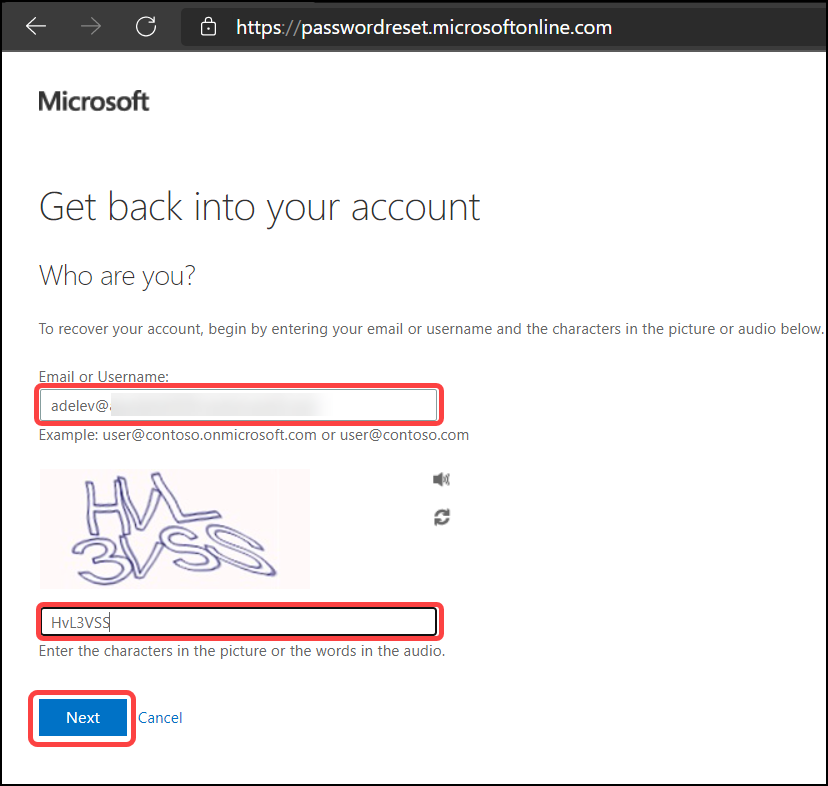

# Exercise: 5 Enable MFA registration using Identity Protection & apply to a user (Adele Vance)

Multi-factor authentication (MFA) is the combination of two things: something you know, something you have, and something you are. Something you know is most commonly a password or PIN. Something you have can be a phone, smart card, or hardware token. Finally, something you are typically means a biometric, such as your face or fingerprint. Azure AD Multi-Factor Authentication provides a means to verify who you are using more than just one factor -a username and password. It introduces a second factor of security to user sign-ins. Which would normally be something you have or something you are. 
For users to be able to respond to MFA prompts, they must first register for Azure AD Multi-Factor Authentication first.

In this section, We will be creating a MFA registration policy and apply to one of the test user.

1. Navigate to Azure AD > Security > Identity Protection > MFA registration policy. On the **MFA registration policy** tab, Under assignments select **Users** and select the fields with the following details then click on **Done** and **Save**.

    | Settings | Value |
    |--|--|
    | Users | Include  **Select individuals and groups**  |
    | Select users |   **Adele Vance**
    | Enforce policy | **On**  |
    | | |

   

## Register and try MFA as end users.

In this section, We will login as **Adele Vence** and register for MFA. We will also enable passwordless sign-in with Microsoft authenticator application. 

The Microsoft Authenticator app can be used to sign in to any Azure AD account without using a password. Microsoft Authenticator uses key-based authentication to enable a user credential that is tied to a device, where the device uses a PIN or biometric. Windows Hello for Business uses a similar technology.

1. Launch a private window in Mircosoft Edge browser and Sign in to Microsoft Azure, you will see the login screen, log in with the user **Adele Vance** (You can find the credentials in lab environment details), and, then click on Next.

   

2. Now enter the password and click on **Sign in**. 

    

    

3. Click on **Next**. 

   

4. Now you need to download the **Microsoft Authenticator app** on your mobile, You can find it in the Google play store for android devices and in app store for Apple devices, After you install the Microsoft Authenticator app on your device, choose "Next".

   

5. On your mobile device open **Microsoft Authenticator app** If prompted, allow notifications. Then add an account, and select "Work or school".

   

6. Select **scan the QR code**. This will connect the Microsoft Authenticator app with your account. After you scan the QR code, choose "Next".

   

7. Approve the notification in **Microsoft Authenticator app**

   

8. After approving the notification, You will see this screen, choose **"Next"**.

   

9. Select **Country Code**, **Enter mobile no.** and **select text me a code** and choose "Next".

   

10. You will get a 6 digits code to your mobile device, Enter the code below. choose "Next".

    

11. On this screen you will see **SMS verified, Your phone was registered successfully.**, choose "Next".

    

12. In this screen you will see the **Success** message.

    

You have now registered **Adele** user's MFA with your device and phone number. 

# Exercise: 6 Enable and configure the Self Service Password Reset portal

Azure Active Directory (Azure AD) self-service password reset (SSPR) gives users the ability to change or reset their password, with no administrator or help desk involvement. If a user's account is locked or they forget their password, they can follow prompts to unblock themselves and get back to work. This ability reduces help desk calls and loss of productivity when a user can't sign in to their device or an application.

In this section, we will enable self-service password reset. 

1. Navigate to Azure Active Directory > Password reset. Click on **Password reset** under the manage section from the menu on the left-hand side.

   

2. From the Properties page, under the option Self service password reset enabled, choose **Select group**, Browse for and **Retail Users** Azure AD group, then choose **Select** and **Save**.

   

3. On the **Authentication methods** page from the menu on the left-hand side, set the **Number of methods** required to reset to 1, check the **Mobile phone** box to enable, and click on **Save**.

   

You have now enabled self-service password reset for retail users. 

## Test self-service password reset

In this section, we will test out the self-service password reset as **Adele** users. 

1. Open a new browser window in InPrivate or incognito mode, and browse to https://aka.ms/sspr, Enter **Adele** user's user id, the characters from the CAPTCHA, and then select Next.

   

2. Select **Text my mobile number**, Enter the mobile number, and click on **Next**.

   

3. You will receive a text message with 6 digit verification code to your phone, Enter the code and click on **Next**

   

4. Now you will get a **choose a password** screen, Enter the new password in **Enter new password** and **Confirm new password** fields and click on **Finish**.

   

8. On this screen you will see a message **Your password has been reset**.

   

In this exercise, you tested self-servie password reset and MFA registration. 
