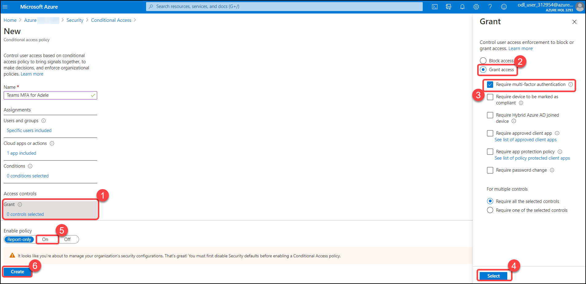
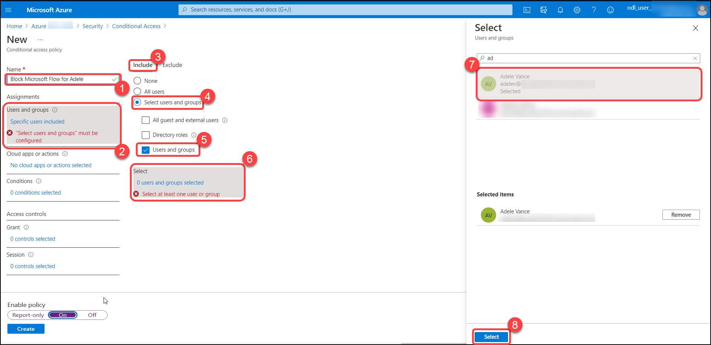
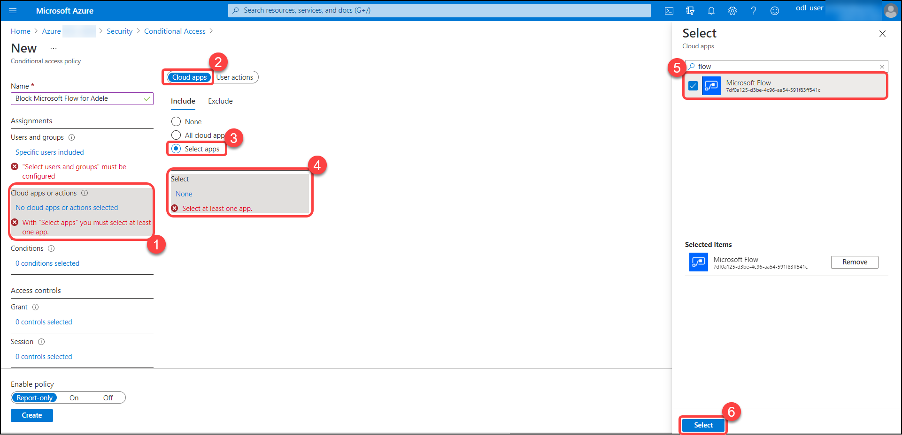

# Exercise: 7 Create a Conditional Access policy to require MFA when accessing Teams and apply to Adele Vance.

Conditional Access is the tool used by Azure Active Directory to bring signals together, to make decisions, and enforce organizational policies. Conditional Access is at the heart of the new identity driven control plane.Conditional Access policies at their simplest are if-then statements, if a user wants to access a resource, then they must complete an action. Example: A payroll manager wants to access the payroll application and is required to perform multi-factor authentication to access it.

In this section, we will be creating conditional access policies and testing them. 

1. Navigate to Azure Active Directory > Security > Conditional Access. Click on **Security**.

   

2. Click on **Conditional Access**.

   

3. Click on add **New policy**.

   

4. Give the policy a name **Teams MFA for Adele**, Under Assignments, select **Users, and groups**, Under Include, **Select users and groups**, Select **Users and groups**, Search and select user **Adele Vance** and click on **select**.

   

5. Under **Cloud apps or actions** > Include, select **Select apps**, Search and select **Microsoft Teams** and click on **select**.

   

6. Under **Access controls** > **Grant**, select **Grant access**, **Require multi-factor authentication**, click **Select**, set **Enable policy** to **On** and Select **Create** to create to enable the policy.

   

# Test Azure AD Conditional Access Policy
In this section, We will test the Azure AD conditional access policy that we just created. 

1. Open a new browser window in InPrivate or incognito mode, and browse to https://teams.microsoft.com/, Enter **Adele Vance**'s username and click on **Next**.

   

2. Enter **Password** and click on **Sign in**.

   

3. You will receive a approve notification in **Microsoft Authenticator app** on your phone, Approve it.

   

4. Click on **Yes**.

   

5. After approving it, You will be logged in to **Teams** and you will see this teams interface.

   

# Exercise: 8 Create a Conditional Access policy to block access to Microsoft Flow 

In this section, We will create another Azure AD Conditional Access policy to block access to another app, **Microsoft Flow**. In this policy, We will block the access for the user. 

1. Navigate to  Azure Active Directory > Security > Conditional Access.Click on **Security**.

   

2. Click on **Conditional Access**.

   

3. Click on add **New policy**.

   

4. Give the policy a name **Block Microsoft Flow for Adele**, Under Assignments, select **Users, and groups**, Under Include, **Select users and groups**, Select **Users and groups**, Search and select user **Adele Vance** and click on **select**.

   

5. Under **Cloud apps or actions** > Include, select **Select apps**, Search and select **Microsoft Flow** and click on select.

   

6. Under **Access controls** > **Grant**, select **Block access**, click **Select**, set **Enable policy** to **On** and Select **Create** to create to enable the policy.

   

# Test Azure AD Conditional Access Policy

In this section, We will test the conditional access policy that we just created and see if Adele gets access to Microsoft Flow.

1. Open a new browser window in InPrivate or incognito mode, and browse to https://flow.microsoft.com/, then click on **Sign in**.

   

2. Enter the **Adele Vance** username and click on **Next**.

   

2. Enter **Password** and click on **Sign in**.

   

3. Now you will see this message **You don't have access to this**.

   
   
   
   
  In this exercise, You tested that Azure AD Conditional access can grant or block access with the conditions that define. 
