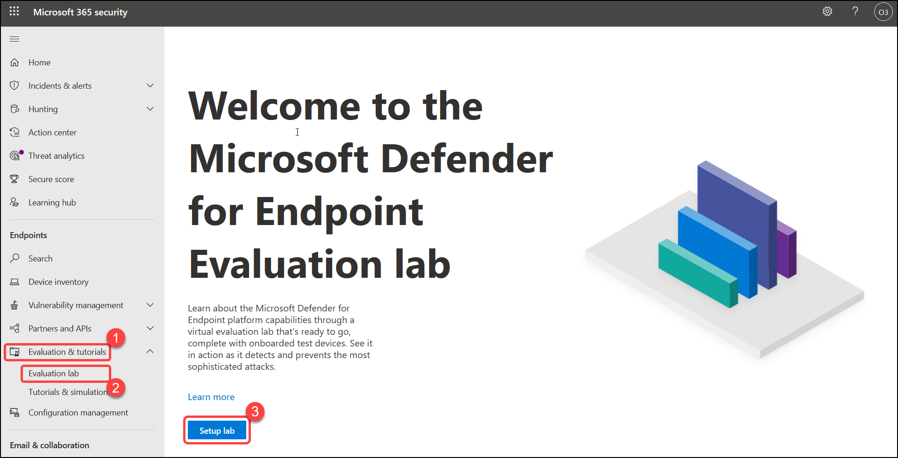
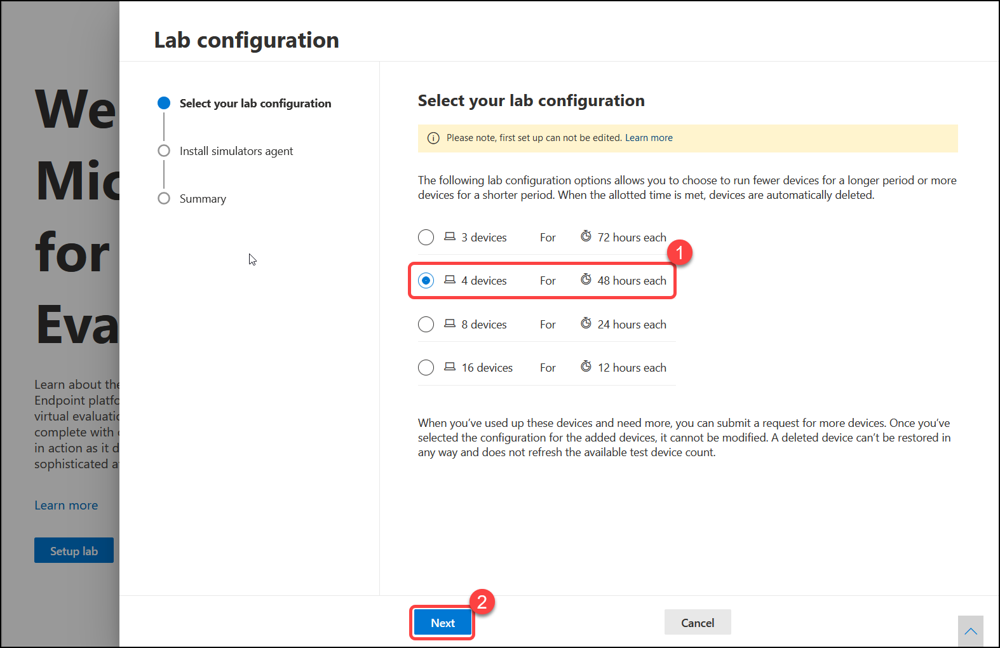

# Microsoft TDefender for Endpoint
Microsoft 365 Defender is a unified pre- and post-breach enterprise defense suite that natively coordinates detection, prevention, investigation, and response across endpoints, identities, email, and applications to provide integrated protection against sophisticated attacks. Microsoft Defender for Endpoint is an enterprise endpoint security platform designed to help enterprise networks prevent, detect, investigate, and respond to advanced threats.

In this exercise, We will be exploring Microsoft Defender for Endpoint. 

## Exercise: 1. Log in to M365 Defender Portal (as admin)

 
 

1. Once the environment is provisioned, a virtual machine (JumpVM) and lab guide will get loaded in your browser. Use this virtual machine throughout the workshop to perform the lab. 

 
 

2. To get the lab environment details, you can select the **Lab Environment** tab. Additionally, the credentials will also be emailed to your email address provided at registration. 

  

    > You will see Deployment ID value on **Lab Environment** tab, use it wherever you see SUFFIX or DeploymentID in lab steps. 

  

3. You can also open the Lab Guide on Separate full window by selecting the **Arrow** icon in the upper right corner. 

  

## Login to Defender Portal

1. In the JumpVM, Launch Microsoft Edge browser using the shortcut available on desktop.  

    

2.  Select **Get started** on the welcome screen. 

 
 

    

    

3. On the next window, click on **Confirm**.  

 
 

    

    

4. Please close the pop-up by clicking **Continue without signing-in** . 

 
 

    

    

5. Now, you will see a default tab in the edge browser, close the first tab named **Microsoft Edge**.  

 
 

    

    

6. Launch **https://securitycenter.microsoft.com**, you will see the login screen, enter the following email/username, and, then click on **Next**.  

   * Email/Username: <inject key="AzureAdUserEmail"></inject> 

    

      

      

7. Now enter the following password and click on **Sign in**. 

   * Password: <inject key="AzureAdUserPassword"></inject> 

    

      

      

8. If you see the pop-up **Stay Signed in?**, click on No.

9. When you open the portal, you'll see:

   (1) Navigation pane (select the horizontal lines at the top of the navigation pane to show or hide it).

   (2) Search, Community center, Localization, Help, and support, Feedback.

     

You are now in Microsoft Defender for Endpoint portal. 

# Exercise: 2. Setup the evaluation lab
Conducting a comprehensive security product evaluation can be a complex process requiring cumbersome environment and device configuration before an end-to-end attack simulation can actually be done. Adding to the complexity is the challenge of tracking where the simulation activities, alerts, and results are reflected during the evaluation.

The Microsoft Defender for Endpoint evaluation lab is designed to eliminate the complexities of device and environment configuration so that you can focus on evaluating the capabilities of the platform, running simulations, and seeing the prevention, detection, and remediation features in action.

In this section, we will be setting up an evaluation lab.

1. In the navigation pane, select Evaluation and tutorials > Evaluation lab, then select Setup lab.

   

2. then select **Setup lab**.

   

3. Select **4 devices** lab configuration, then select **Next**.

   

4. Accept and provide consent to the terms and information sharing statements.

   

5. choose to install threat simulators in the lab, Check box the all the fields, Fill the email, first name, last name. and click on **Next**.

   

6. Review the summary and select Setup lab

   

7. It takes few minutes for lab provisioning to start.  You will see the devices creation progress on your portal. It may take 10 to 15 minutes for provisioning to complete.

   

You have now created Microsoft Defender for endpoint evaluation lab. 

## Exercise: 3. Onboard Windows 10 devices using a local script.

In this section, We will understand you can onboard device to Defender for endpoint using a local script. We will try running these scripts on our evaluation labs. 

1. In the navigation pane, select Settings > Onboarding, Select Windows 10 as the operating system, In the Deployment method field, select Local Script, Click Download package, and save the .zip file.

   

2. In the navigation pane, select Evaluation and tutorials > Evaluation lab, then select Devices, click on **Connect** for first device **testmachine1**, You will get a prompt to download RDP file, Download it.

   

3. Open the RDP file, and when prompted sign in with the credentials you which you have saved at Exercise: 2 > Task 2

    - User Name:

    - Password:

   

4. Now copy the local script file where you have downloaded it at Exercise: 3 > task 1 and paste  in **testmachine1** VM

   

5. Right click on the copied script and click Run as administrator.

   

6. On Desktop, then you will get below window, Type **Y** and Press **Enter Key** to run the script

   

7. Then Press any key to continue

   

8. Similarly do the same to the second device ****testmachine2** VM

You have now completed onboarding of devices. You should see these devices listed on devices page in Defender portal.
