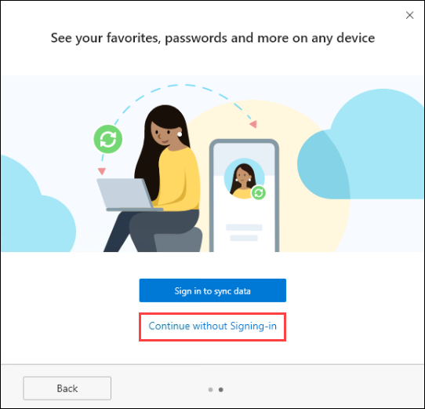
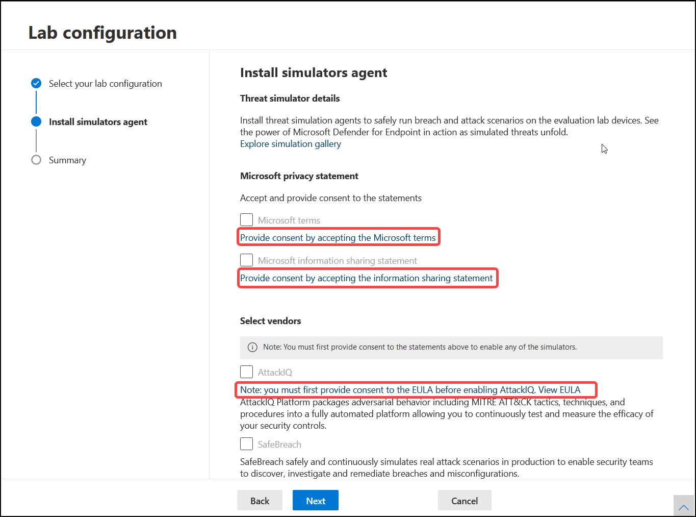
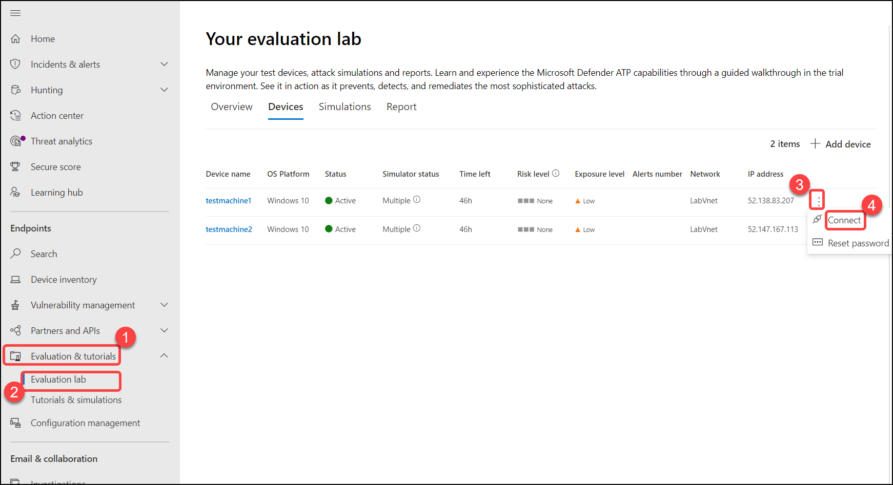

# Microsoft Threat Protection Tech Intensity

Microsoft Defender Security Center is the portal where you can access Microsoft Defender for Endpoint capabilities. It gives enterprise security operations teams a single pane of glass experience to help secure networks.

## Exercise 1: Log in to Defender Portal (as admin)

 
 

## Instructions 

 
 

1. Once the environment is provisioned, a virtual machine (JumpVM) and lab guide will get loaded in your browser. Use this virtual machine throughout the workshop to perform the lab. 

 
 

2. To get the lab environment details, you can select the **Lab Environment** tab. Additionally, the credentials will also be emailed to your email address provided at registration. 

  

    > You will see Deployment ID value on **Lab Environment** tab, use it wherever you see SUFFIX or DeploymentID in lab steps. 

  

3. You can also open the Lab Guide on Separate full window by selecting the **Arrow** icon in the upper right corner. 

  

## Login to Defender Portal

1. In the JumpVM, click on the Defender Portal shortcut of the Microsoft Edge browser which is created on the desktop. 

    

2. When you click on Defender Portal, the edge browser welcome screen will come up, select **Get started**. 

 
 

    

    

3. On the next window, click on **Confirm**. 

 
 

    

    

4. Now, you can close the popup which is coming up. 

 
 

    

    

5. Now, you will see two tabs in the edge browser, close the first tab named **Microsoft Edge**. 

 
 

    

    

6. On the **Sign in to your account** tab, you will see the login screen, enter the following email/username, and, then click on **Next**.  

   * Email/Username: <inject key="AzureAdUserEmail"></inject> 

    

      

      

7. Now enter the following password and click on **Sign in**. 

   * Password: <inject key="AzureAdUserPassword"></inject> 

    

      

      

8. If you see the pop-up **Stay Signed in?**, click on No.

9. When you open the portal, you'll see:

   (1) Navigation pane (select the horizontal lines at the top of the navigation pane to show or hide it).

   (2) Search, Community center, Localization, Help, and support, Feedback.

     

# Exercise: 2 Setup the evaluation lab

1. In the navigation pane, select Evaluation and tutorials > Evaluation lab, then select Setup lab.

   

2. then select **Setup lab**.

   

3. Select **4 devices** lab configuration, then select **Next**.

   

4. Accept and provide consent to the terms and information sharing statements.

   

5. choose to install threat simulators in the lab, Check box the all the fields, Fill the email, first name, last name. and click on **Next**.

   

6. Review the summary and select Setup lab

   

7. It takes few minutes to be done, Once it's done you will get this screen

   

# Exercise: 3 Provision Defender for Endpoint Evaluation lab with 4 devices and consenting to AttackIQ and SafeBreach.

## Add devices

1. From the dashboard, select Add device, choose to add Windows 10, and **Add device**

   

2. The connection details are displayed. Select Copy to save the password for the device.
   
   
   > **Note**: The password is only displayed once. Be sure to save it for later use.

   

3. Similarly add the second device and copy the password, By following the step one and two.

## Exercise: 3 Onboard Windows 10 devices using a local script.

1. In the navigation pane, select Settings > Onboarding, Select Windows 10 as the operating system, In the Deployment method field, select Local Script, Click Download package, and save the .zip file.

   

2. In the navigation pane, select Evaluation and tutorials > Evaluation lab, then select Devices, click on **Connect** for first device **testmachine1**, You will get a prompt to download RDP file, Download it.

   

3. Open the RDP file, and when prompted sign in with the credentials you which you have saved at Exercise: 2 > Task 2

    - User Name:

    - Password:

   

4. Now copy the local script file where you have downloaded it at Exercise: 3 > task 1 and paste it in **testmachine1** VM

   

5. Right click on the copied script and click Run as administrator.

   

6. On Desktop, then you will get below window, Type **Y** and Press **Enter Key** to run the script

   

7. Then Press any key to continue

   

8. Similarly do the same to the second device ****testmachine2** VM