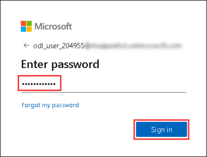
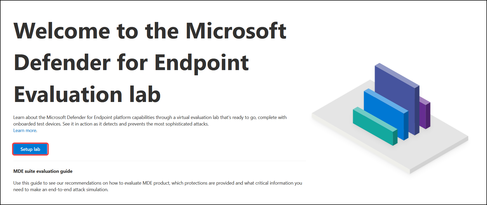

# Microsoft Defender for Endpoint

Microsoft 365 Defender is an integrated and cross-domain threat-detection suite designed for enterprise. It helps to prevent, detect, investigate, and remediate sophisticated threats across endpoints. Eliminating persistent threats through natively coordinating detection, prevention, investigation, and response. Microsoft 365 Defender focuses on proactive hunting and other critical tasks, like creating custom tools and applying proprietary tactics and knowledge to better defend the organization.

With the help of these 3 Exercises, We will be exploring more about Microsoft Defender for Endpoint.

## Exercise: 1. Log in and setup M365 Defender Portal (as admin)

 
 

1. Once the environment is provisioned, a virtual machine (JumpVM) and lab guide will get loaded in your browser. Use this virtual machine throughout the workshop to perform the lab. 

 
 

2. To get the lab environment details, you can select the **Lab Environment** tab. Do note, all login credentials will be sent to your email address provided at registration. 

  

    > On the **Lab Environment tab** you will find Deployment ID, note it down as you will be required to enter this ID wherever you see SUFFIX or Deployment ID in lab steps.

  

3. You can also open the Lab Guide on Separate full window by selecting the **Arrow** icon in the upper right corner.

  

## Login to Defender Portal

1.	Using JumpVM, Launch Microsoft Edge browser from the shortcut available on the desktop.

    

2. Select **Get started** on the welcome screen. 

 
 

   

    

3. On the next window, click on **Confirm**.  

 
 

    

    

4. Please close the pop-up by clicking **Continue without signing-in** . 

 
 

    

    

5. Now, you will see a default tab in the edge browser, close the first tab named **Microsoft Edge**.  

 
 

    

    

6. Launch **https://securitycenter.microsoft.com**, you will see the login screen, enter your registered email/username and click **Next**. 

   * Email/Username: <inject key="AzureAdUserEmail"></inject>

    

   

      

7.	Now enter your password and click on **Sign in**.

   * Password: <inject key="AzureAdUserEmail"></inject>

    

   

      

8.	First-time users may get a pop-up window requesting access to **Stay Signed in**, click on **No**.

9. When you open the portal, you'll see:

   (1) Navigation pane (select the horizontal lines at the top of the navigation pane to show or hide it).

   (2) Search Bar, Community Center, Localization, Feedback section, Help and Support.

   

You are now in Microsoft Defender for Endpoint portal. 

# Exercise: 2. Setup the evaluation lab
Evaluating network security strength can be a complex process. It requires various environment and device configurations and setups. Although this might seem cumbersome, it is unavoidable as it is a prerequisite to successfully simulate an end-to-end attack on the network. Adding to the complexity is the challenge of tracking where the simulation activities, alerts, and results are reflected during the evaluation process.

Microsoft Defender for Endpoint evaluation lab is designed to eliminate such complexities so that you can solely focus on evaluating the capabilities of the platform, running simulations, and seeing the prevention, detection, and remediation features in action.

In this section, we will be setting up an evaluation lab.

1. In the navigation pane, select Evaluation and tutorials > Evaluation lab, then select Setup lab.

   

2. Then select **Setup lab**.

   

3. Select **4 devices** lab configuration, then select **Next**.

   

4. Accept and provide consent to the terms and information sharing statements.

   

5. To install threat simulators in the lab, Select all the Check-boxes. Fill the email, first name, last name and click on **Next**.

   

6. Review the summary and select Setup lab

   

7. Wait for few minutes for the lab provisioning to start. You will see the devices creation progress on your portal. This process may take 10 to 15 minutes to complete.

   

## Add devices

1. From the dashboard, select Add device, choose to add Windows 10, and click **Add device**

   

2. The connection details are displayed. Select Copy to save the password for the device.
   
   
   > **Note**: The password is only displayed once. Be sure to save it for later use.

   

3. Similarly add the second device and copy the password, By following the step one and two.

You have now created Microsoft Defender for endpoint evaluation lab. 

# Exercise: 3. Onboard Windows 10 devices using a local script.
In this section, We will discuss how you can onboard device to Microsoft Defender for endpoint, using a local script. We will try running these scripts on our evaluation labs.

1. In the navigation pane, select Settings > Onboarding. Select Windows 10 as the operating system. In the Deployment method field, select Local Script. Click Download package, and save the .zip file.

   

2. In the navigation pane, select Evaluation and tutorials > Evaluation lab, then select Devices, click on **Connect** for first device **testmachine1**, You will get a prompt to download RDP file, Download it.

   

3. Open the RDP file and when prompted sign in with the credentials which you have saved at Exercise: 2 > Task 2

   * User name:
   
   * Password:

   

4. Now copy the local script file, the one that you have downloaded at Exercise: 3 > task 1 and paste in **testmachine1** VM.

   

5. Right click on the copied script and click **Run as administrator**.

   

6. Once you do that, you will see a black window appear on the screen. This is the command screen containing the script. Type Y and Press Enter Key to run it.

   

7. Then Press any key to continue

   

8.	Similarly, repeat the process for the second device **testmachine2** VM.

You have now completed onboarding of devices. You should see these devices listed on devices page in Defender portal.
