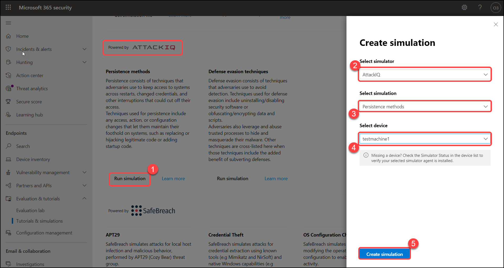

# Exercise: 4 Perform all attacks in the evaluation lab

1. By navigating from the navigation pane **Evaluation and tutorials** > **Simulation & tutorials**, then select **Simulations catalog**.

   

2. Select a Run simulation, In create simulation tab, Select fields with the following details then click on **Create simulation**.

    | Settings | Value |
    |--|--|
    | Select simulator | **AttackIQ**  |
    | Select simulation | **Persistence methods**  |
    | Select device | **testmachine1**  |
    | | |

   

3. View the progress of a simulation by selecting the Simulations tab. View the simulation state, active alerts, and other details.

   

4. View all the available simulations by going to Simulations and tutorials > Simulations catalog from the menu. A list of supported third-party threat simulation agents are listed, and specific types of simulations along with detailed descriptions are provided on the catalog.

    You can conveniently run any available simulation right from the catalog.

   

5. Under Explore results > Click on **Evaluation report**

   

## Evaluation report

The lab reports summarize the results of the simulations conducted on the devices.

   