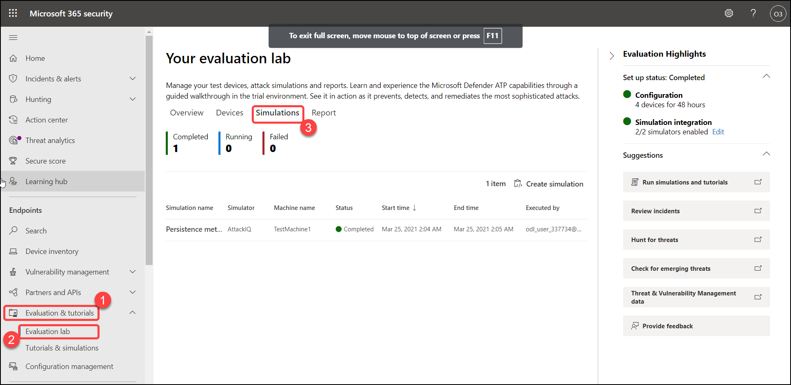
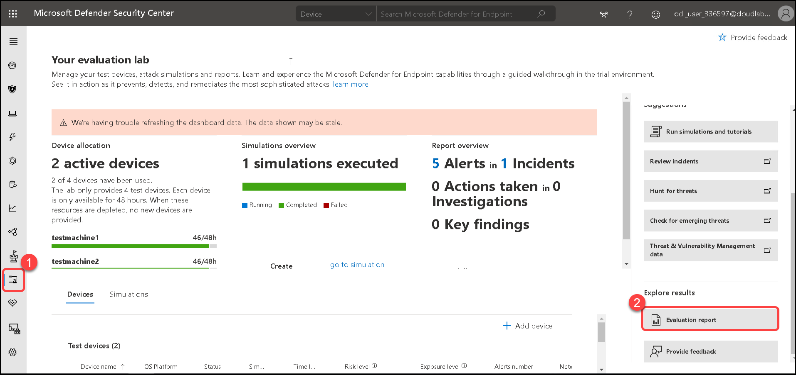

# Exercise: 4. Simulate attacks in the evaluation lab

In this section, we will be exploring Microsoft 365 Defender Attack Simulator feature. We will be using the simulation scenarios that are available in Defender portal. Do note, these scripts are safe, documented, and easy to use. These scenarios will evaluate Defender for its Endpoint protection capabilities and walk you through the investigation experience.

1. From the navigation pane, click on **Evaluation and tutorials** > **Tutorials & Simulation**, then select **Simulations catalog**.

   

2. Click on Run simulation, from the right panel under Create simulation window, select fields with the following details then click on **Create simulation**.

    | Settings | Value |
    |--|--|
    | Select simulator | **AttackIQ**  |
    | Select simulation | **Persistence methods**  |
    | Select device | **testmachine1**  |
    | | |

   

3. Soon after the simulation starts, an alert will be generated under the **Incidents** tab. Please take a moment to look at the incident details and explore available options.

   

4. View the progress of a simulation by selecting the **Simulations** tab. View the simulation state, active alerts, and other valuable details.

   

5. View all the available simulations by going to **Tutorials and simulations** > **Simulations** catalog from the menu. Lists containing all the supported third-party threat simulation agents are listed here. You can also find the specific types of simulations along with the detailed descriptions on this **catalog**.

    You can conveniently run any available simulation right from the catalog.

   

6. Under Explore results > Click on **Evaluation report**.

   

## Evaluation report

6. The lab reports summarize the results of the simulations conducted on the devices.

   

7. Please repeat the steps for additional simulations that you may want to try out. 

In this section, we simulated alerts and explored the incidents generated in Defender ATP center. 
