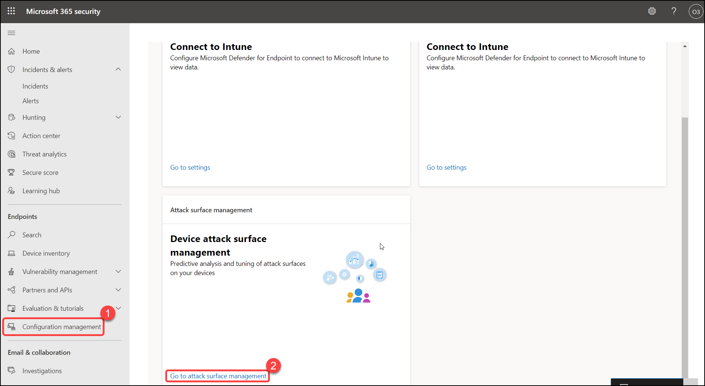
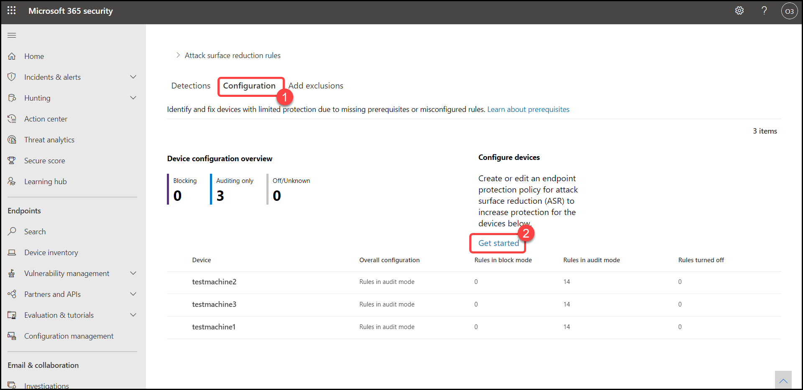
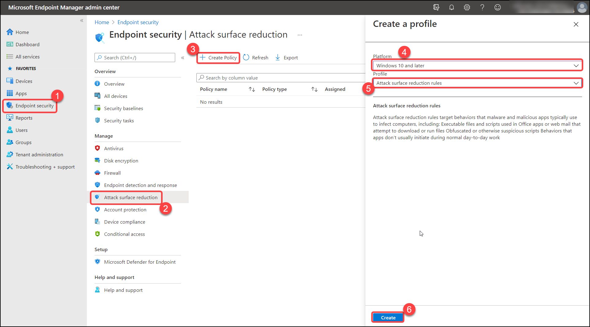
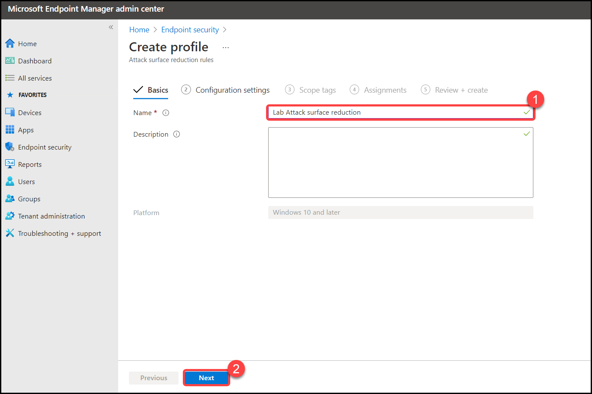
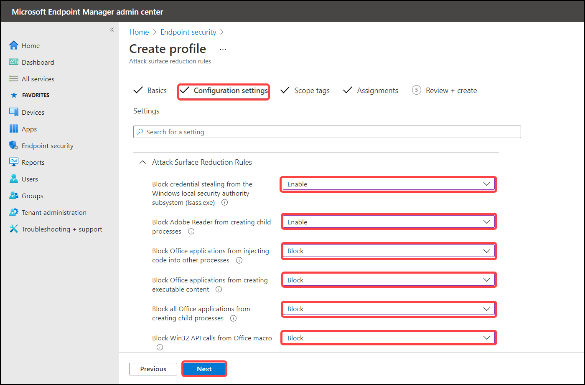
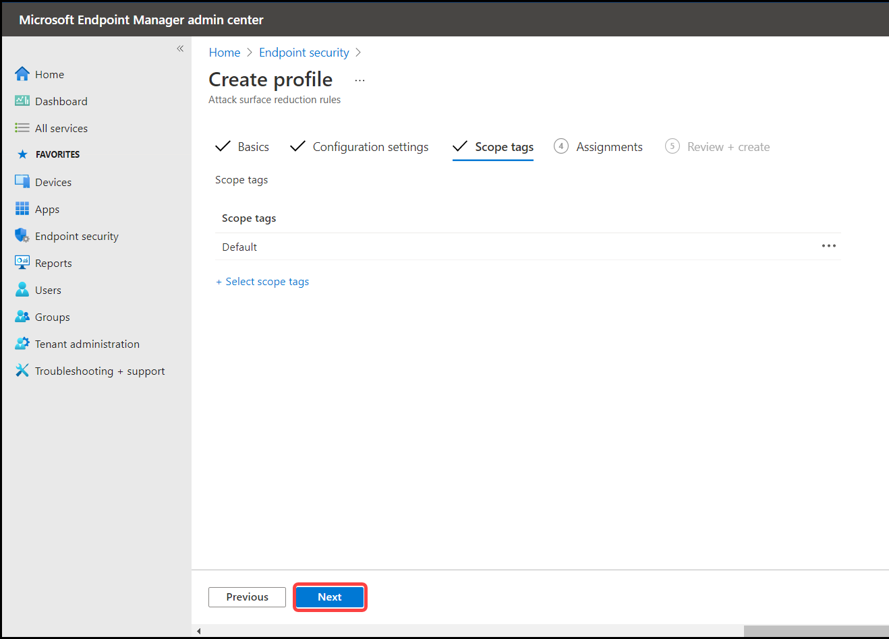
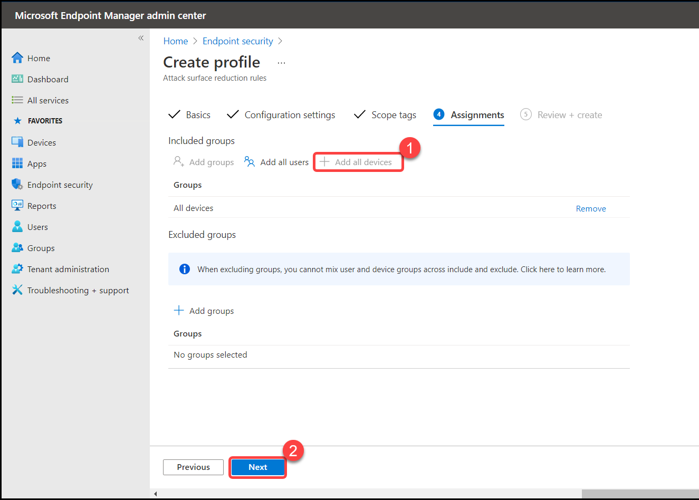
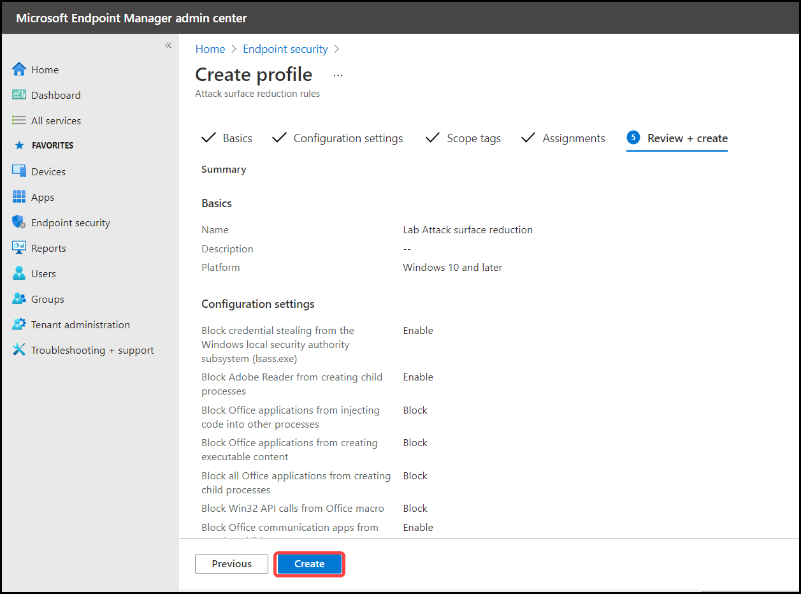

# Exercise: 5. Enable attack surface reduction rules 

Your organization's attack surface includes all the places where an attacker could compromise your organization's devices or networks. Reducing your attack surface means protecting your organization's devices and network, which leaves attackers with fewer ways to perform attacks. Configuring attack surface reduction rules in Microsoft Defender for Endpoint can help!

Attack surface reduction rules target certain software behaviors, such as:

Launching executable files and scripts that attempt to download or run files;
Running obfuscated or otherwise suspicious scripts; and
Performing behaviors that apps don't usually initiate during normal day-to-day work.

In this section, we will be using Microsoft EndPoint Manager to enable attack surface reduction rules.

1. By navigating from the navigation pane **Configuration Management**, then select **Go to attack surface management**.

   

2. Click on **Configuration** > **Get started**.

   

3. Navigate from the **Endpoint security** > **Attack surface reduction** >  **Create policy**, Select fields with the following details then click on **Create**.

    | Settings | Value |
    |--|--|
    | Platform | **Windows 10 and later**  |
    | Profile | **Attack surface reduction rules**  |
    | | |

   

4. In the name give **Lab Attack surface reduction**, Click on **Next**

   

5. In configuration settings, Select fields with the following details then click on **Next**.

    | Settings | Value |
    |--|--|
    | Block credential stealing from the Windows local security authority subsystem (lsass.exe) | **enable**  |
    | Block Adobe Reader from creating child processes | **enable**  |
    | Block Office applications from injecting code into other processes | **block**  |
    | Block Office applications from creating executable content  | **block**  |
    | Block all Office applications from creating child processes | **block**  |
    | Block Win32 API calls from Office macro | **block**  |
    | Block Office communication apps from creating child processes | **enable**  |
    | Block execution of potentially obfuscated scripts (js/vbs/ps) | **block**  |
    | Block JavaScript or VBScript from launching downloaded executable content | **block**  |
    | Block process creations originating from PSExec and WMI commands  | **block**  |
    | Block untrusted and unsigned processes that run from USB | **block**  |
    | Block executable files from running unless they meet a prevalence, age, or trusted list criteria | **block**  |
    | Block executable content download from email and webmail clients | **block**  |
    | Use advanced protection against ransomware | **enable**  |
    | Enable folder protection | **enable**  |
    | | |

   

6. In scope tag, Leave default values and click **next**

   

7. In Assignments select **Add all devices**

   

8. In Review + create, Click on **create**

   
   
   
   
   You have now created attack surface reduction policy in Microsoft Endpoint Manager. This policy must be applied to users or devices in order to take effect on devices in your organization.
