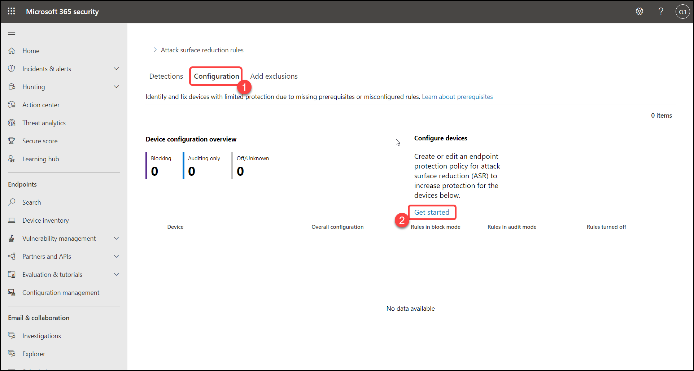

# Exercise: 5 Enable attack surface reduction rules via Intune

1. By navigating from the navigation pane **Configuration Management**, then select **Go to attack surface management**.

   

2. Click on **Configuration** > **Get started**.

   

3. Navigate from the **Endpoint security** > **Attack surface reduction** >  **Create policy**, Select fields with the following details then click on **Create**.

    | Settings | Value |
    |--|--|
    | Platform | **Windows 10 and later**  |
    | Profile | **Attack surface reduction rules**  |
    | | |

   

