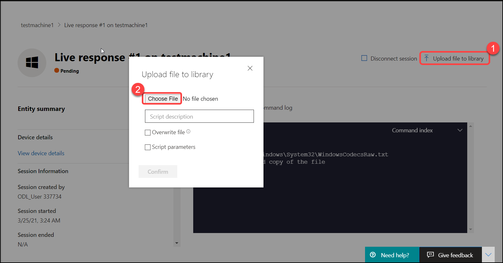
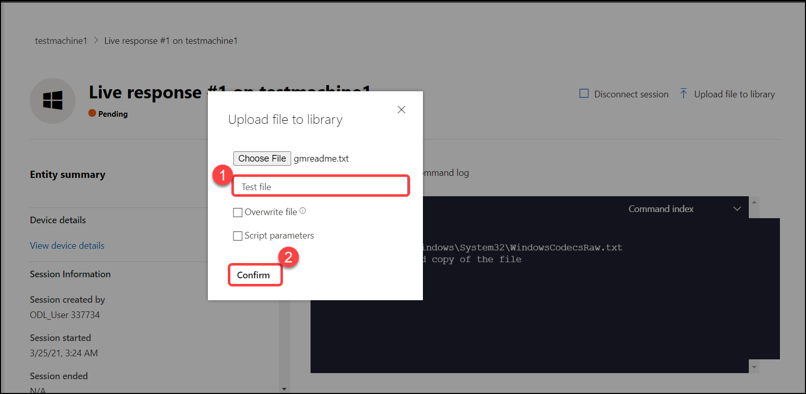

# Exercise: 6. Initiate a Live Response session.

The Live response feature gives instantaneous access to a potentially compromised machine, regardless of location, by using a remote shell. Analysts use this capability to quickly gather any forensic information that is essential for threat investigation. This gives you the power to do in-depth investigative work and take immediate response actions to promptly contain identified threats—in real-time.

Live response is designed to enhance investigations by enabling your security operations team to collect forensic data, run scripts, send suspicious entities for analysis, remediate threats, and proactively hunt for emerging threats.

## Before you begin.

### Before you can initiate a session on a device, make sure you fulfill the following requirements:
   * Enable live response from the advanced settings page.
   * Enable the live response capability on the Advanced features settings page.
   * Enable live response for servers from the advanced settings page.

1. In the navigation pane, select **Settings** > Click on **Advanced features** under General> Turn on **Live response**, **Live Response for Servers**, **Live Response unsigned script execution** and click on **Save preferences**.

   

2. On the left panel look for the icon that resembles a laptop, which is the **Device inventory** section. Click on it and then click on **testmachine1**.

   

3. To launch the live response session click on the icon with three dots and from the top right corner of the page and select **Initiate live response session**.

   

4. After you initiate the live response session a command console will be displayed. Wait while the session connects to the device.

   

##   Get a file from the device

1.  Download a file from a machine by executing the below command.

    
    getfile c:\Windows\System32\WindowsCodecsRaw.txt
 

   

2. Now you will get a pop-up window to save the file, click on save.

   

## Put a file in the library

1. Click **Upload file to library**, Click **Choose File**.

   

2. Go to this location "C:/Windows/System32" and select this **WindowsCodecsRaw** file and click on **Open**.

   

3. Provide a brief description and Click **Confirm**.For this exercise we have named it **Test file**

   

4. To verify that the file was uploaded to the library, run the library command. you can see the uploaded file in the list. Click on **Disconnect session**.

   
   
   
   
   
   In this section, You used one of the lab machine to test the live response functionality of M365 Defender. 
