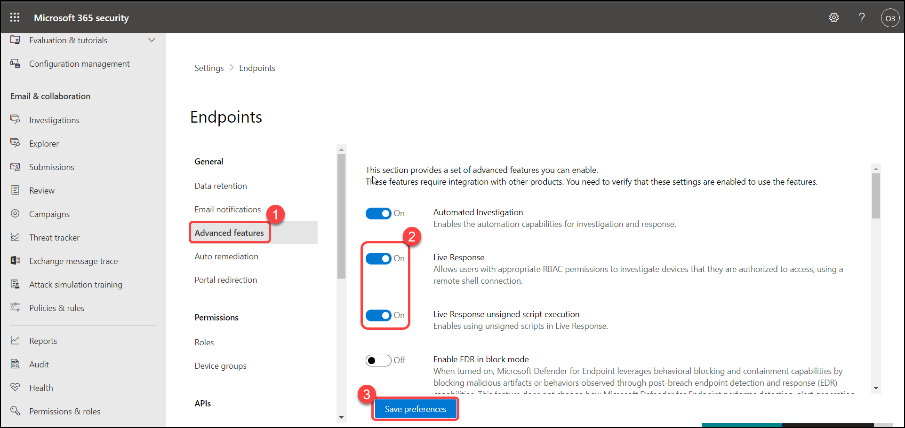
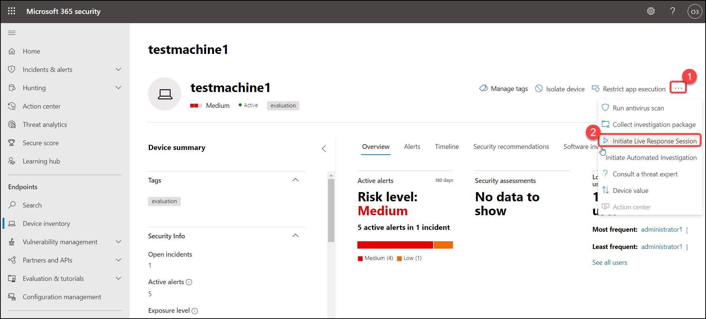
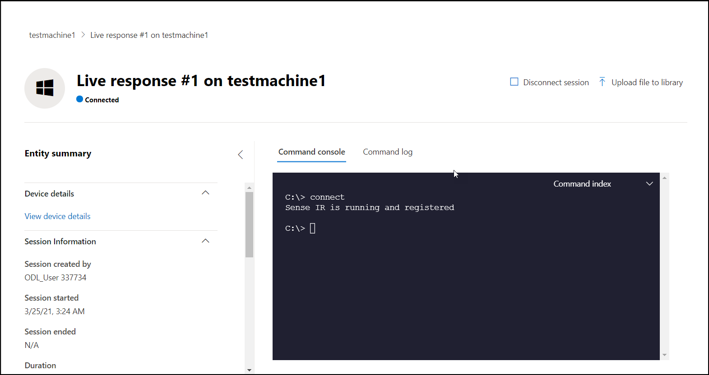

# Exercise: 6 Initiate a Live Response session.

The live response gives security operations teams instantaneous access to a device (also referred to as a machine) using a remote shell connection. This gives you the power to do in-depth investigative work and take immediate response actions to promptly contain identified threats—in real-time.

Live response is designed to enhance investigations by enabling your security operations team to collect forensic data, run scripts, send suspicious entities for analysis, remediate threats, and proactively hunt for emerging threats.

## Before you begin.

### Before you can initiate a session on a device, make sure you fulfill the following requirements:
    > Enable live response from the advanced settings page.
    > You'll need to enable the live response capability on the Advanced features settings page.
    > Enable live response for servers from the advanced settings page.

1. Go to settings > Advanced features > Turn on **Live response**, **Live Response for Servers**, **Live Response unsigned script execution** and click on **Save preferences**.

   

2. Now go to **Device inventory** click on **testmachine1**.

   

3. Launch the live response session by selecting **Initiate live response session**.

   

4. A command console is displayed. Wait while the session connects to the device.

   

##   Get a file from the device

1.  Download a file from a machine by executing the below command.

    
    getfile c:\Windows\System32\WindowsCodecsRaw.txt
 

    

2. Now you will get a pop-up window to save the file, click on save.

   

## Put a file in the library

1. Click **Upload file to library**, Click **Choose File**.

   

2. Copy this location "C:\Windows\System32\ThirdPartyNoticesBySHS.txt" and paste in **File Name** and click on **Open**.

   

3. Provide a brief description and Click **Confirm**.

   

4. To verify that the file was uploaded to the library, run the library command. you can see the uploaded file in the list. Click on "Disconnect session".

   