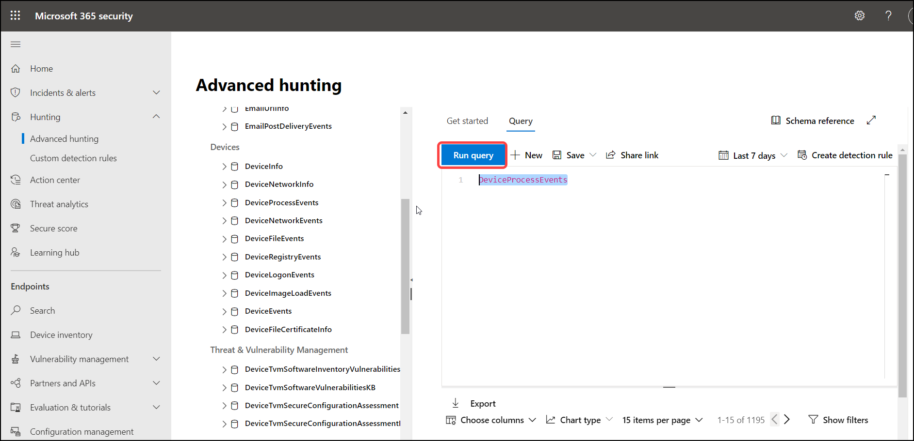
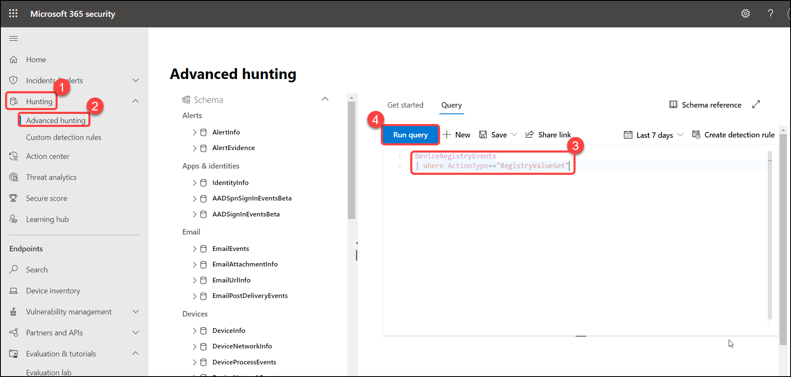
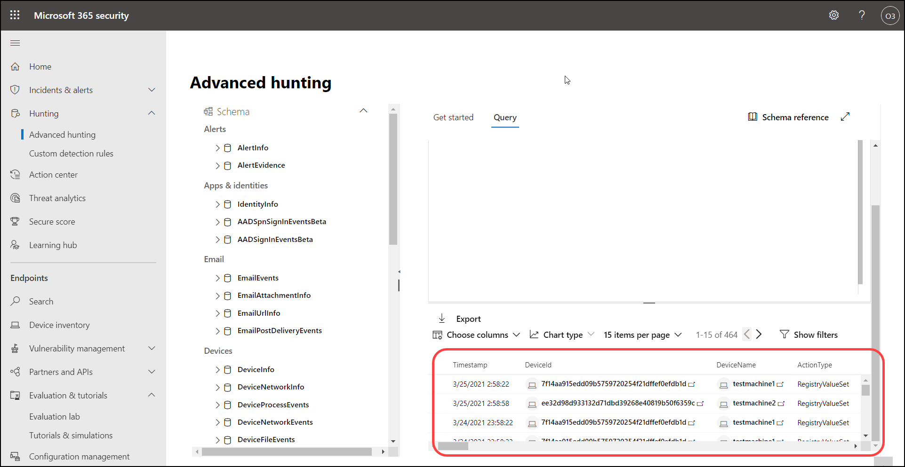

# Exercise: 7. Create and run an Advanced Hunting query.


Advanced hunting is a query-based threat-hunting tool that lets you explore up to 30 days of raw data. You can proactively inspect events in your network to locate threat indicators and entities. The flexible access to data enables unconstrained hunting for both known and potential threats.

You can use the same threat-hunting queries to build custom detection rules. These rules run automatically to check for and then respond to suspected breach activity, misconfigured machines, and other findings.


1. In the navigation pane, select **Hunting** > **Advanced hunting** > Double Click **DeviceProcessEvents** > and click **Run query**.


   


2. Click on **Run query** again.


   


3. Scroll down to see the list of query output.


   


### Next, we will try using one of the hunting queries provided in the simulation lab


1. From the navigation pane, click on **Evaluation and tutorials** > **Tutorials & Simulation**, then select **Learn more**, it opens a blade on the right side of portal.


   


2. Now scroll down to see the Sample MDE Advanced Hunting queries for the specific attack, Copy the 2 lines.
   


   ```
       DeviceRegistryEvents
       | where ActionType=="RegistryValueSet"
   ```


   


3. Go to **Hunting** > **Advanced hunting** > Click on **Query**, Paste the 2 lines copied in **Type a query** and click on **Run query**.


   


4. Scroll down to see the query output.


   


5. Do more by opening up the other simulations.


# Exercise: 8. Configure alert notifications in Microsoft Defender for Endpoint


You can configure Defender for Endpoint to send email notifications to specified recipients for new alerts. This feature enables you to identify a group of individuals who will immediately be informed and can act on alerts based on their severity.


1. In the navigation pane, select **Settings** > **Endpoint** Click on **Email notifications**, next click on **Add item**. Under General section select the following items and click on **Next**.


   


2. Next, enter the recipient's email address (odl_user) the one you used to login to the portal and click Add. This will add your registered email address under the Recipient email address bar. You will be able to test the functionality by clicking on Send test email


   


3. Open a new tab and go to https://outlook.live.com/, Log with your odl user and you will find a mail with the subject **Microsoft Defender ATP Test Email**


   


4. Click Save and you are done.


   
   
   
   You have now completed configuring email notifications for alerts. 
