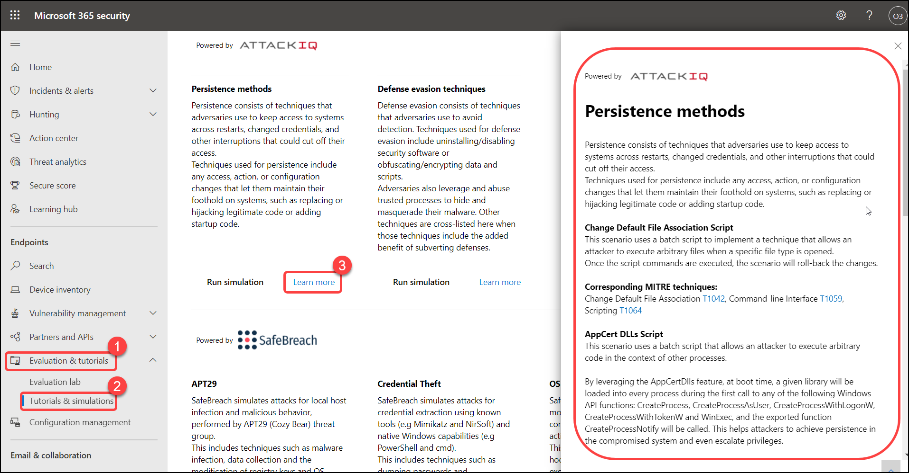

# Exercise: 7. Create and run an Advanced Hunting query.

Advanced hunting is a query-based threat-hunting tool that lets you explore up to 30 days of raw data. You can proactively inspect events in your network to locate threat indicators and entities. The flexible access to data enables unconstrained hunting for both known and potential threats.

You can use the same threat-hunting queries to build custom detection rules. These rules run automatically to check for and then respond to suspected breach activity, misconfigured machines, and other findings.

1. Go to Advanced hunting > Get started > select any of those queries and **Run query**.

   

2. Click on **Run query**.

   

3. Scroll down to see the query output.

   

### Now try using one of the hunting queries provided in the simulation lab

1. From the navigation pane, click on **Evaluation and tutorials** > **Simulation & tutorials**, then select **Learn more**, it opens a blade on the right.

   

2. Now scroll down to see Sample MDE Advanced Hunting queries for the specific attack, Copy 2 lines.
   
    DeviceRegistryEvents
    where ActionType=="RegistryValueSet"

   

3. Go to Advanced hunting > Query, Paste the 2 lines copied in **Type a query** and click on **Run query**.

   

4. Scroll down to see the query output.

   

5. Do more by opening up the other simulations.

# Exercise: 8. Configure alert notifications in Microsoft Defender for Endpoint

You can configure Defender for Endpoint to send email notifications to specified recipients for new alerts. This feature enables you to identify a group of individuals who will immediately be informed and can act on alerts based on their severity.

1. In the navigation pane, select Settings > Alert notifications, Click on Add item, Select the following items and click on **Next**

   

2. Enter the recipient's email address then click Add recipient (odl_user ) the one which you are logged into the portal and Check the email recipient can receive the email notifications by selecting Send test email.

   

3. Open a new tab and go to https://outlook.live.com/, Log with your odl user and you will find a mail with the subject **Microsoft Defender ATP Test Email**

   

4. Click the Save notification rule.

   
   
   
   You have now completed configuring email notifications for alerts. 
